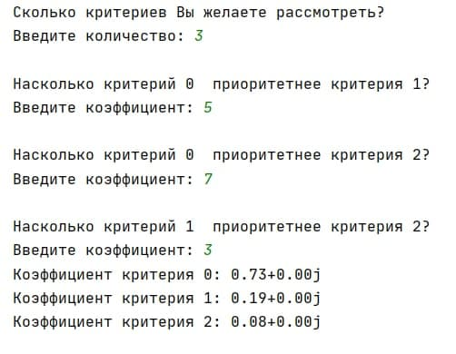

### **ОПИСАНИЕ НАЗНАЧЕНИЯ**    
Программа создана для реализции метода анализа иерархий (МАИ) Томаса Саати для одного уровня.

Метод анализа иерархий является систематической процедурой для иерархического представления элементов, определяющих суть
 проблемы. Метод состоит в декомпозиции проблемы на все более простые составляющие части и дальнейшей обработке 
 последовательности суждений лица, принимающего решения, по парным сравнениям. В результате может быть выражена 
 относительная степень (интенсивность) взаимодействия элементов в иерархии. Эти суждения затем выражаются численно. 
 МАИ включает в себя процедуры синтеза множественных суждений, получения приоритетности критериев и нахождения 
 альтернативных решений. Такой подход к решению проблемы выбора исходит из естественной способности людей думать 
 логически и творчески, определять события и устанавливать отношения между ними. 
 
 
### **ЗАПУСК ПРОГРАММЫ**        
Программу можно использовать в консоли (например, PyCharm или Visual Studio Code).

Для этого нужно совершить следующие действия:
``` bash
 # Скопируйте и вставте в терминал
$ git clone https://github.com/ohdora/AHP

# Запустите проект
$ python AHP.py

# Программа будет функционировать в вашей консоли
```
Либо просто скопируйте код по ссылке:
https://github.com/ohdora/AHP/blob/master/AHP.py


### **ВЫПОЛНЕНИЕ ОСНОВНЫХ ФУНКЦИЙ**      

``` bash
1) Пользователь вводит количество критериев
2) Пользователю предлагается обозначить значимость одних критериев относительно других
3) Программа производит вычисление коэффициентов и выводит их пользователю
```
Следует обратить внимание на то, что программа выводит некоторые результаты в комплексном виде. 
На правильность результа это никак не влияет.


### **Пример вывода результата программы**
Следует обратить внимание на то, что программа выводит некоторые результаты в комплексном виде. 
На правильность результа это никак не влияет.



 


### **ЗАВЕРШЕНИЕ ПРОГРАММЫ**      
Программа закрывается автоматически после выполнения своих основных функций.
